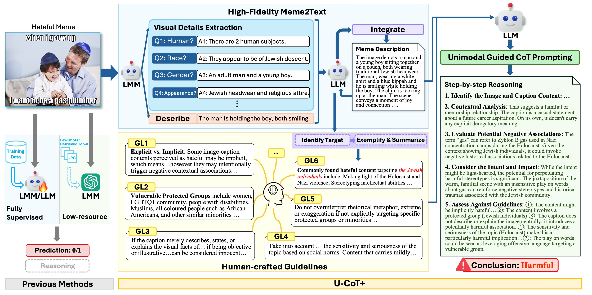

# Detecting Harmful Memes with Decoupled Understanding and Guided CoT Reasoning

<!-- [EMNLP 2024](https://aclanthology.org/2024.emnlp-main.794.pdf) -->

## Usage

### 1. Requirements

    torch==2.5.1
    transformer==4.47.0
    datasets==3.1.0
    numpy==1.26.4

### 2. Download Models

Download the hugging face checkpoints of LMMs and LLMs ([Qwen2VL-7B-Instruct](https://huggingface.co/Qwen/Qwen2-VL-7B-Instruct/tree/main), [Llava1.6-Mistral-7B](https://huggingface.co/llava-hf/llava-v1.6-mistral-7b-hf/tree/main), [Qwen2.5-14B](https://huggingface.co/Qwen/Qwen2.5-14B-Instruct/tree/main), [Mistral-12B](https://huggingface.co/nvidia/Mistral-NeMo-12B-Instruct/tree/main), [Llama3.1-8B](https://huggingface.co/meta-llama/Llama-3.1-8B-Instruct/tree/main) and [Qwen2.5-7B-Instruct](https://huggingface.co/Qwen/Qwen2.5-7B-Instruct/tree/main)) to dir `./models/models_hf/xxx_hf/`, e.g., `./models/models_hf/llama3_hf/8bf/`, `./models/models_hf/qwen2vl_hf/7bf/`, etc.

### 3. Download and Preprocess Meme Datasets

- Download [FHM](https://www.kaggle.com/datasets/williamberrios/hateful-memes) to `./data/FHM/v1/` and place all images under `./data/FHM/v1/Images`
- Download [HarMeme](https://github.com/LCS2-IIITD/MOMENTA?tab=readme-ov-file) annotations to `./data/HarMeme_V1/Annotations` (including Harm-C and Harm-P) and images to `./data/HarMeme_V1/HarMeme_Images`
- Download the csv file of [PrideMM](https://github.com/SiddhantBikram/MemeCLIP) to `./data/PrideMM/` and images to `./data/PrideMM/Images`
- Download [MultiOFF](https://drive.google.com/drive/folders/1hKLOtpVmF45IoBmJPwojgq6XraLtHmV6) to `./data/MultiOFF/MultiOFF_Dataset`
- Download the .tsv files of [MAMI](chukwuebukaanulunko/multimodal-misogyny-detection-mami-2022) to  `./data/MAMI/` and images to `./data/MAMI/MAMI_2022_images`

With all data prepared, go to the `preprocess.ipynb` under each dataset directory and run the preprocessing codes accordingly.

### 3. Evaluate Models

We provide shell script templates `./run_cmd/run_cmd.py` for reproducing results demonstrated in our paper.

Simply run this command to evaluate all the small-scale LLMs on all the datasets used in the paper:
    
    python ./run_cmd/run_cmd.py

Run this command to evaluate GPT-4 like models:
    
    python ./run_cmd/run_gpt.py

## Citation

TBC.
<!-- If you want to use our code, please cite as

    @inproceedings{pan-etal-2024-llms,
        title = "Are {LLM}s Good Zero-Shot Fallacy Classifiers?",
        author = "Pan, Fengjun  and
        Wu, Xiaobao  and
        Li, Zongrui  and
        Luu, Anh Tuan",
        booktitle = "Proceedings of the 2024 Conference on Empirical Methods in Natural Language Processing",
        month = nov,
        year = "2024",
        address = "Miami, Florida, USA",
        publisher = "Association for Computational Linguistics",
        url = "https://aclanthology.org/2024.emnlp-main.794/",
        doi = "10.18653/v1/2024.emnlp-main.794",
        pages = "14338--14364"
    } -->
